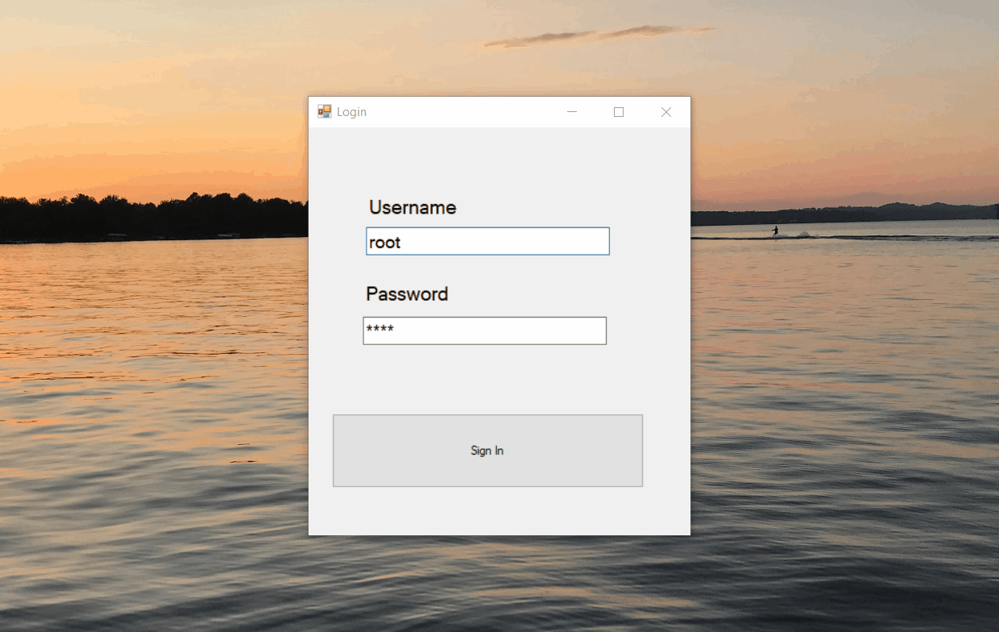

# InventoryApplication

This is a Windows Forms application written in C# for managing users, products, customers and orders. This app utilizes a database to preform CRUD operations. The UI design is plain and simple.

### Requirements
* Visual Studio IDE
* SQL Server
* SQL Server Management Studio

## Installation
To build and run this app you must meet the requirements. If the 
requirements are met then skip the installation section.

### Visual Studios IDE Installation
1. View Microsoft's official Visual Studios [download page](https://visualstudio.microsoft.com/downloads/)
2. Select Visual Studios 2019 Community and install
3. After the installation completes open Visual Studio Installer
4. Select and install 
    * .NET Desktop Development
    * Data Storage and Processing
    
### SQL Server Installation
1. View Microsoft's official SQL Server [download page](https://www.microsoft.com/en-us/sql-server/sql-server-downloads)
2. Select Developer or Express then download
3. Choose the basic installation type
4. Install at default directory location

### SQL Server Management Studio Installation
1. View Microsoft's official (SSMS) [download page](https://docs.microsoft.com/en-us/sql/ssms/download-sql-server-management-studio-ssms?view=sql-server-ver15)
2. Click the link to download SSMS
3. Follow the steps and click install at the end
4. After the setup is complete launch SSMS
5. Create a server or log into one

 ## Configuration
 
 

## License
This project is licensed under MIT. Please see [LICENSE file](https://github.com/nate51315/InventoryApplication/blob/master/LICENSE)
